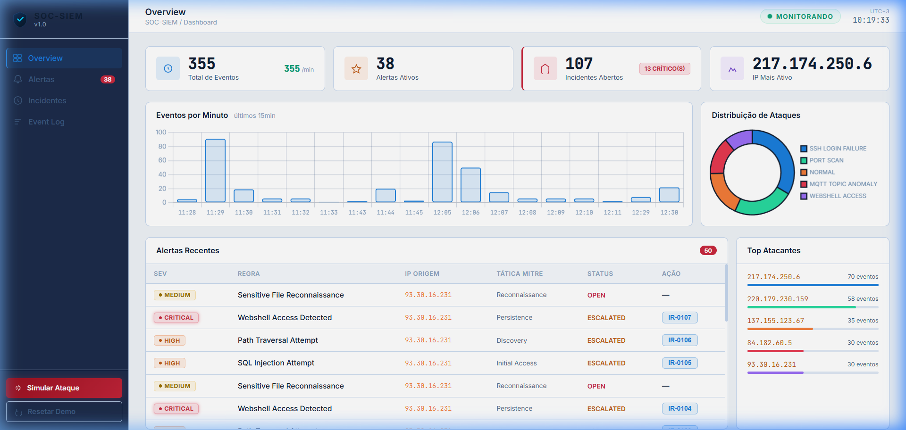

# 🛡️ SOC-SIEM Caseiro — Personal Security Operations Center

> Mini-SIEM profissional em Python com ingestão de logs reais via VPS honeypot, motor de detecção estilo SIGMA com mapeamento MITRE ATT&CK, resposta automática a incidentes e dashboard web em tempo real.

**Stack:** Python 3 · Flask · SQLite · Chart.js · Paramiko · HTML/CSS/JS

---

## 📸 Preview



---

## ✨ Funcionalidades

| Módulo | O que faz |
|--------|-----------|
| **log_generator.py** | Gera logs sintéticos realistas para 4 cenários de ataque |
| **vps_collector.py** | Coleta logs reais de um VPS honeypot via SSH (paramiko) |
| **rules_engine.py** | 9 regras SIGMA-like com mapeamento MITRE ATT&CK |
| **alert_manager.py** | Escalada automática HIGH/CRITICAL → Incidente |
| **incident_responder.py** | Playbooks de contenção + relatórios IR em Markdown |
| **app.py** | API REST Flask + motor de detecção rodando em background (10s) |
| **Dashboard web** | Tema claro profissional, Chart.js, polling 4s, 4 painéis |

---

## 🚀 Início Rápido

### 1. Instalar dependências
```bash
cd "SOC-SIEM"
pip install -r requirements.txt
```

### 2. Configurar segurança (necessário antes de iniciar)
```bash
# O arquivo .env já foi gerado com uma chave de API segura
# Para ver ou regenerar:
python -c "import siem_config; print('API Key:', siem_config.get_api_key())"
```

### 3. Iniciar o SIEM
```bash
python app.py
# ou clique em start.bat
```

### 4. Acessar o Dashboard
```
http://localhost:5000
```

O SIEM gera dados de demonstração automaticamente na primeira execução.

---

## 🗂️ Estrutura do Projeto

```
SOC-SIEM/
├── app.py                    # Servidor Flask + orchestração
├── siem_config.py            # Carrega .env, gerencia API key
├── siem_db.py                # Banco SQLite (eventos, alertas, incidentes)
├── log_generator.py          # Gerador de logs sintéticos (4 cenários)
├── rules_engine.py           # Motor de regras SIGMA-like
├── alert_manager.py          # Gerenciador de alertas + escalada automática
├── incident_responder.py     # Fluxo IR + relatórios Markdown
├── vps_collector.py          # Coletor de logs reais via SSH (honeypot)
├── vps_setup.sh              # Script de configuração do VPS honeypot
├── .env                      # ⚠️ Não commitar — chaves secretas
├── .env.example              # Template de configuração
├── requirements.txt
├── start.bat                 # Inicialização com 1 clique (Windows)
├── templates/index.html      # Dashboard web
├── static/
│   ├── css/style.css         # Tema claro profissional
│   └── js/dashboard.js       # Polling + Chart.js
└── docs/
    ├── detection_rules.md        # Catálogo de regras
    ├── vps_honeypot_guide.md     # Guia completo do honeypot
    └── incident_report_template.md
```

---

## 🎭 Cenários de Ataque

### Dados Sintéticos (integrados)

| Cenário | Eventos | Regras |
|---------|---------|--------|
| SSH Brute-Force | `SSH_LOGIN_FAILURE × N` + `SSH_LOGIN_SUCCESS` | SSH-001, SSH-002 |
| Web Attack | `SQL_INJECTION`, `XSS`, `PATH_TRAVERSAL`, `WEBSHELL_ACCESS` | WEB-001 a WEB-005 |
| MQTT Anomaly | `MQTT_TOPIC_ANOMALY` | IOT-001 |
| Port Scan | `PORT_SCAN` | NET-001 |

```bash
# Via CLI
python log_generator.py --scenario ssh --count 30
python log_generator.py --scenario all --count 200
```

### Dados Reais — VPS Honeypot

Coleta ataques SSH reais da internet. Em < 30 min de VPS exposto você já tem brute-force de IPs de múltiplos países.

```bash
# 1ª conexão — salva fingerprint do servidor
python vps_collector.py --host SEU_IP --user root --key ~/.ssh/id_rsa --trust-host

# Conexões seguintes — verificação automática
python vps_collector.py --host SEU_IP --user root --key ~/.ssh/id_rsa
```

Ver guia completo: [docs/vps_honeypot_guide.md](docs/vps_honeypot_guide.md)

---

## 🔍 Regras de Detecção (MITRE ATT&CK)

| ID | Nome | Severidade | Técnica |
|----|------|-----------|---------|
| SSH-001 | SSH Brute-Force Detected | HIGH | T1110.001 |
| SSH-002 | Login Após Brute-Force | CRITICAL | T1078 |
| WEB-001 | SQL Injection Attempt | HIGH | T1190 |
| WEB-002 | XSS Attempt | MEDIUM | T1059.007 |
| WEB-003 | Path Traversal | HIGH | T1083 |
| WEB-004 | Webshell Access | CRITICAL | T1505.003 |
| WEB-005 | Sensitive File Recon | MEDIUM | T1595 |
| NET-001 | Port Scan Detected | MEDIUM | T1046 |
| IOT-001 | MQTT Topic Anomaly | MEDIUM | T1210 |

---

## 🔐 Segurança

| Camada | Mecanismo |
|--------|-----------|
| API Key (Bearer Token) | Obrigatório em `/api/ingest` — protege ingestão externa |
| IP Allowlist | Opcional — restringe ingestão ao IP do VPS |
| SSH Host Key Verification | `RejectPolicy` + `known_hosts` — sem trust cego |
| Host Fingerprint | Exibido a cada conexão SSH para auditoria |
| Limite de payload | 500 eventos/req · 2KB/linha · strip de null bytes |

### Configuração (`.env`)

```env
SIEM_API_KEY=sua_chave_aqui        # gerada automaticamente
VPS_ALLOWED_IP=123.45.67.89        # IP do seu VPS (opcional)
INGEST_MAX_EVENTS_PER_REQUEST=500
SIEM_PORT=5000
SIEM_PUBLIC=0                      # 0 = somente localhost
```

> ⚠️ **Adicione `.env` ao `.gitignore`** — ele contém sua chave de API.

---

## 🌐 API REST

| Método | Endpoint | Descrição |
|--------|----------|-----------|
| GET | `/` | Dashboard HTML |
| GET | `/api/events` | Últimos eventos (paginado) |
| GET | `/api/alerts` | Alertas (filtro: `?status=OPEN`) |
| GET | `/api/incidents` | Lista de incidentes |
| GET | `/api/stats` | Métricas em tempo real |
| POST | `/api/simulate` | Simular cenário: `{"scenario":"ssh"}` |
| GET | `/api/report/<id>` | Relatório IR em Markdown |
| POST | `/api/reset` | Limpar banco (demo) |
| POST | `/api/ingest` | **Ingestão externa** (requer API Key) |

### Exemplo: ingestão via curl
```bash
curl -X POST http://localhost:5000/api/ingest \
  -H "Authorization: Bearer SUA_CHAVE" \
  -H "Content-Type: application/json" \
  -d '{"raw": "Sep 17 10:00:01 srv sshd[1234]: Failed password for root from 1.2.3.4 port 22"}'
```

---

## 🔄 Fluxo de Detecção e Resposta

```
Logs Sintéticos  ──┐
                   ├──► siem_db.py (SQLite)
VPS Honeypot SSH ──┘           │
/api/ingest      ──────────────┘
                                │
                    rules_engine.py — avalia a cada 10s
                    (9 regras SIGMA-like + MITRE ATT&CK)
                                │ dispara
                    alert_manager.py
                    (HIGH/CRITICAL → escalada automática)
                                │
                    incident_responder.py
                    (playbook + relatório IR .md)
                                │
                    Dashboard HTTP (poll 4s)
```

---

## 📚 Para o Portifólio / Currículo

**Frase recomendada:**
> "Mini-SIEM com coleta de logs em tempo real de servidor honeypot exposto à internet. Detecta brute-force SSH, SQLi, Webshell e Port Scan com regras SIGMA-like mapeadas ao MITRE ATT&CK. Gera alertas automáticos e relatórios de Incident Response em Markdown."

**Skills demonstradas:**

- `SIEM` `SOC` `Incident Response` `Log Analysis` `Threat Detection`
- `Python 3` `Flask` `SQLite` `REST API` `Paramiko`
- `MITRE ATT&CK` `SIGMA Rules` `Honeypot`
- `Chart.js` `HTML/CSS/JS` `Dashboard`

---

## 📋 Pré-requisitos

- Python 3.10+
- pip
- Para o honeypot: acesso a um VPS Linux (Oracle Free Tier, DigitalOcean, etc.)

## ⚠️ Aviso Legal

Este projeto é para fins **educacionais e de portifólio**. Os logs sintéticos são gerados localmente e não realizam nenhuma ação de rede real. O honeypot VPS é um servidor **seu próprio** sendo monitorado.
